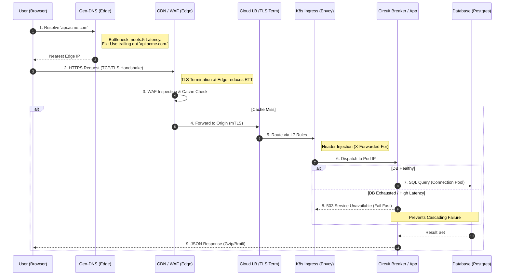
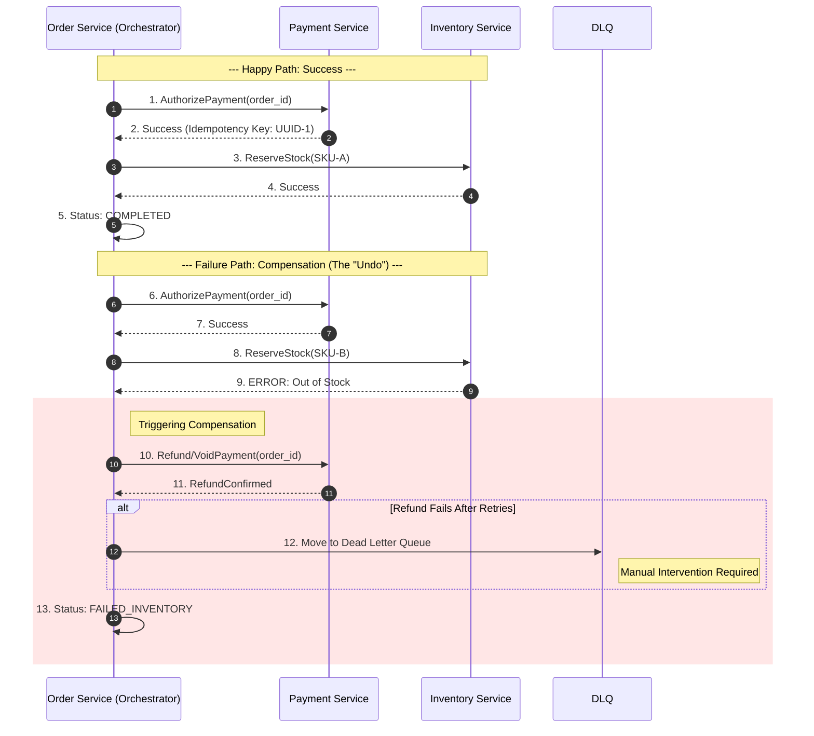
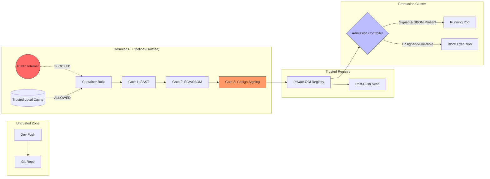
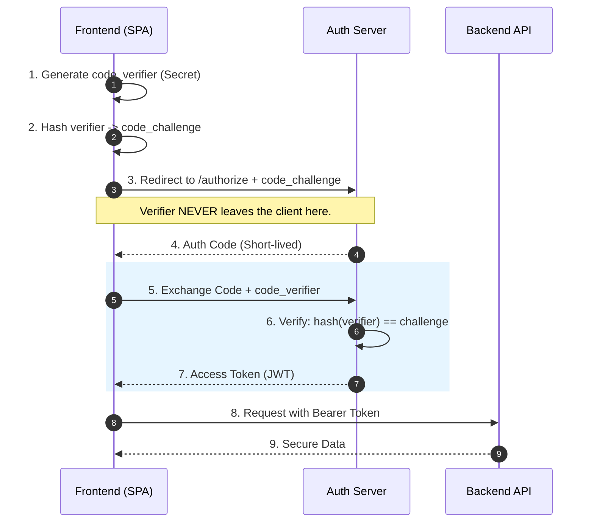
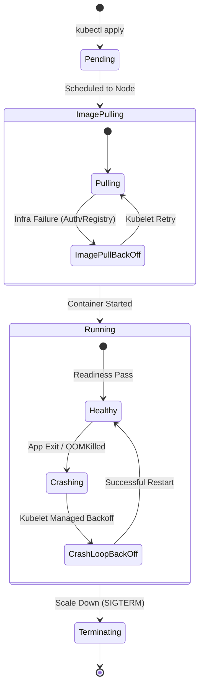

This comprehensive guide provides high-fidelity architectural blueprints for the most critical workflows in modern cloud-native systems. Each section is designed to "unfog" complex mental models by highlighting the friction points—latency, security boundaries, and data consistency risks—that distinguish a Senior Architect's perspective from a standard implementation.

---

### 1. The Global Request Lifecycle: Edge to Database
This diagram visualizes the journey of a packet, emphasizing where latency accumulates and where "silent killers" like DNS misconfiguration can degrade performance.



**Senior Insight: The `ndots:5` and Circuit Breaking**
*   **DNS Latency:** By default, Kubernetes DNS search paths can cause up to 4 unnecessary lookups (NXDOMAIN) for external domains. Using a **trailing dot** in your API calls (e.g., `api.google.com.`) bypasses this loop, saving 10-40ms per request.
*   **Cascading Failures:** A senior architect never lets an application wait indefinitely for a struggling database. Implementing a **Circuit Breaker** at the Ingress or App level ensures that if the DB connection pool is exhausted, the system "fails fast," preserving resources for other healthy services.

---

### 2. Distributed Transactions: The Saga Pattern (Orchestration)
In microservices, ACID is impossible across boundaries. We use Sagas to ensure eventual consistency through compensating transactions.



**Senior Insight: Idempotency & The DLQ**
*   **Idempotency:** All compensating actions (Refunds/Voids) **must** be idempotent. If a network flicker causes the Orchestrator to retry the Refund call, the Payment service must recognize the duplicate request and not process a second refund.
*   **The "Un-compensatable" Failure:** If a compensating transaction fails (e.g., the Payment API is down during a refund), the Saga cannot simply stop. You must implement a **Dead Letter Queue (DLQ)** for manual reconciliation to prevent "zombie" data states where money is taken but no goods are delivered.

---

### 3. Secure Software Supply Chain (DevSecOps)
This workflow visualizes the "Hermetic Isolation" required for Zero Trust CI/CD, ensuring only vetted, signed code reaches production.



**Senior Insight: Hermetic Isolation & SBOMs**
*   **Hermetic Build:** A "Senior" pipeline is disconnected from the public internet during the build phase. This prevents **Dependency Confusion** attacks. All libraries must be pulled from a pre-vetted local cache.
*   **SBOM (Software Bill of Materials):** Modern governance requires generating an SBOM at build time. This allows security teams to instantly identify which pods are running a newly discovered vulnerability (e.g., Log4Shell) without re-scanning the entire cluster.

---

### 4. OpenTelemetry (Otel) Data Flow
Observability is a cost-management challenge. This diagram shows how the Otel Collector acts as the "Intelligence Layer" to filter noise.

```mermaid
graph TD
    subgraph "Applications"
        Go[Go App] -->|gRPC| Coll
        Py[Python App] -->|HTTP| Coll
    end

    subgraph "Otel Collector"
        Recv[Receiver] --> Buffer[Trace Buffer / Delay Window]
        Buffer --> TBS{Tail-based Sampler}
        TBS -->|Error/Slow| Export1[Jaeger]
        TBS -->|Probabilistic 1%| Export1
        
        Recv --> Agg[Metric Aggregator]
        Note right of Agg: Warning: High Cardinality Labels!
        Agg --> Export2[Prometheus]
    end

    subgraph "Backends"
        Export1
        Export2
        Recv --> Export3[Loki/Logs]
    end

    style TBS fill:#f96,stroke:#333
    style Buffer fill:#dfd,stroke:#333
```

**Senior Insight: Tail-based Sampling & Cardinality**
*   **The Buffer Window:** Tail-based sampling requires a **Buffer**. The collector waits for all spans of a trace to arrive (the "tail") before deciding whether to keep it. This ensures 100% of error traces are saved while "boring" 200 OKs are dropped to save storage costs.
*   **Cardinality Bomb:** The Metric Aggregator must be guarded against high-cardinality labels (e.g., putting `user_id` in a Prometheus metric). This can crash your observability backend by creating millions of unique time series.

---

### 5. Identity & Auth: OIDC / OAuth2 with PKCE
This "cryptographic dance" is the industry standard for securing public clients (SPAs/Mobile) where secrets cannot be safely stored.



**Senior Insight: Preventing Code Interception**
*   **The Cryptographic Bind:** By sending the `code_challenge` (a one-way hash) in the initial redirect, the Auth Server records the intent. Even if an attacker steals the `auth_code` from the browser URL, they cannot exchange it for a token because they don't have the original `code_verifier`. This binds the token issuance to the specific browser session that initiated it.

---

### 6. Kubernetes Deployment State Lifecycle
This state machine is the primary diagnostic tool for SREs during an incident, distinguishing between infrastructure and code failures.



**Senior Insight: The Diagnostic Pivot**
*   **ImagePullBackOff = Infrastructure:** If a pod is stuck here, stop looking at the code. Check your Registry credentials, Image tags, or Network policies.
*   **CrashLoopBackOff = Application:** The container *did* start, meaning the "pipe" is working, but the process died. Pivot immediately to `kubectl logs` to find the runtime panic or missing environment variable. Understanding that the **Kubelet** manages the exponential backoff (not the app) is key to setting appropriate `initialDelaySeconds` in probes.
